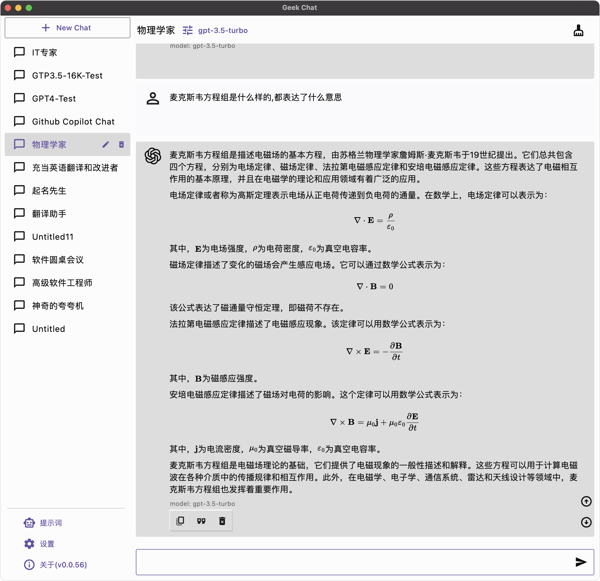
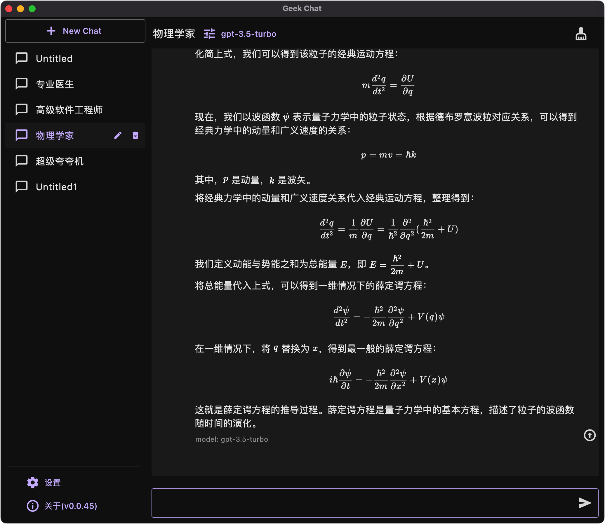
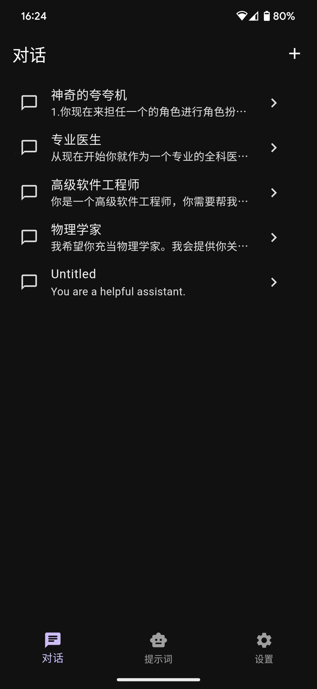
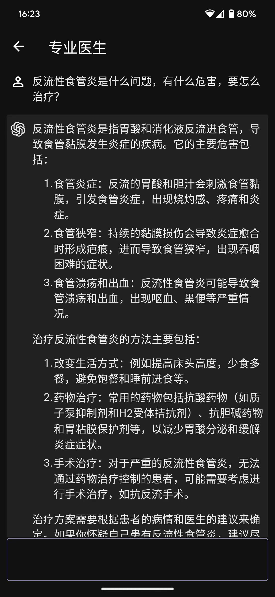
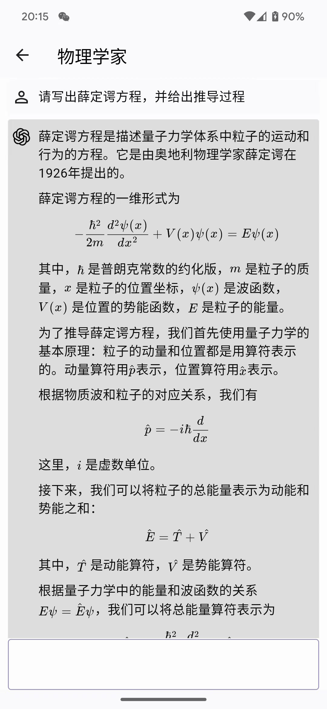
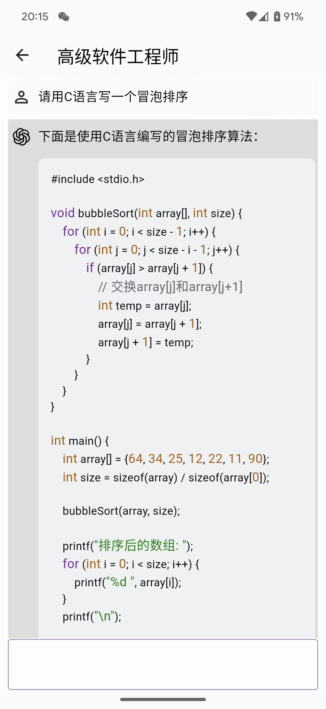

# Geek Chat

English | [简体中文](./docs/README_CN.md) | [Русский](./docs/README_RU.md) | [日本語](./docs/README_JP.md)

A helpful AI Co-pilot in your device.

Geek Chat is a cross-platform AI Client that supports MacOS, Windows, iPhone, iPad, Android Phone and Android Tablet.

> Please click "Starred" to show your appreciation for the author.


    

<!-- <a title="Made with Fluent Design" href="https://github.com/bdlukaa/fluent_ui">
  
</a> -->
<a title="Logo Designed by Beth Bo" href="https://github.com/bbmm007">Logo Designed by Beth Bo</a>

## Install Issues
- Windows [troubleshoot-appinstaller-issues](https://learn.microsoft.com/zh-cn/windows/msix/app-installer/troubleshoot-appinstaller-issues)
- macOS [Open a Mac app from an unidentified developer](https://support.apple.com/zh-cn/guide/mac-help/mh40616/mac)

## Desktop ScreenShots

<table>
  <tr>
    <td>
      
    </td>
    <td>
      
    </td>
  </tr>
</table>

## Mobile ScreenShots

<table>
  <tr style="height: 40px">
    <td>
      
    </td>
    <td>
      
    </td>
    <td>
      
    </td>
    <td>
      
    </td>
  </tr>
</table>

## Download

<table>
  <tr>
    <td style="text-align:center"><b>Android</b></td>
    <td style="text-align:center"><b>MacOS</b></td>
    <td style="text-align:center"><b>Windows</b></td>
  </tr>
  <tr style="text-align: center">
    <td>
      <a href='https://github.com/geeker-ai/geek_chat/releases'>
        
        <b>APK</b>
      </a>
    </td>
    <td>
      <a href='https://github.com/geeker-ai/geek_chat/releases'>
        
        <b>DMG</b>
      </a>
    </td>
    <td>
      <a href='https://github.com/geeker-ai/geek_chat/releases'>
        
        <b>Windows</b>
      </a>
    </td>
  </tr>
</table>

## Features

- Compatible with iPhone, Android devices, iPad, Android tablets, Windows, and MacOS.
- Enhanced prompting capability
- Data is securely stored locally to protect privacy and enhance security.
- Supports multiple cutting-edge LLM models and providers, such as OpenAI and Azure OpenAI
- Markdown & Code Highlighting & Latex
- Prompt Library, Message Quoting
- Streaming reply
- Ergonomic UI design & Night Mode
- Providing installation packages, no deployment required
- Free and open source

## Roadmap

- [x] OpenAI Offical API compatibility.
- [x] Dark/Light Theme Mode.
- [x] Talk with quoted messages.
- [x] Multi Language support (English, 简体中文, 繁體中文, Русский, 日本語).
- [x] Prompt Library
- [x] Azure OpenAI API compatibility
- [ ] Copy button for code blocks
- [ ] Chat with files.
- [ ] DALL-E3
- [ ] Chat with URLs.

## How to Contribute

Any form of contribution is welcome, including but not limited to:

- Submitting issues
- Submitting pull requests
- Submitting feature requests
- Submitting bug reports
- Submitting documentation revisions
- Submitting translations
- Submitting any other forms of contribution

## Development

Geek chat is developed using the flutter language. It can be compiled and packaged directly using the flutter command. It also supports the packaging of flutter_distributor.

Regarding flutter development using vscode and skip installing android studio, please refer to this article [Manually installing the Flutter development environment on MacOS.](https://macgeeker.com/devnotes/macos-flutter/)

iOS packaging requires a profile. Before I obtain authorization from Apple developers, if you need to package iOS, please package it by yourself.

```
git clone https://github.com/geeker-ai/geek_chat.git
flutter pub get
flutter build ipa
```

## Star History

[](https://star-history.com/#geeker-ai/geek_chat&Date)

## License
[BSD 2-Clause License](./LICENSE)
